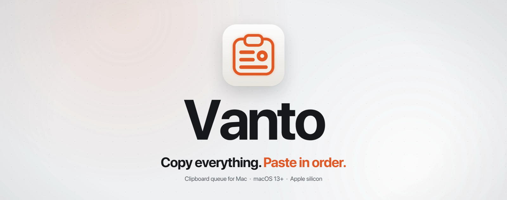
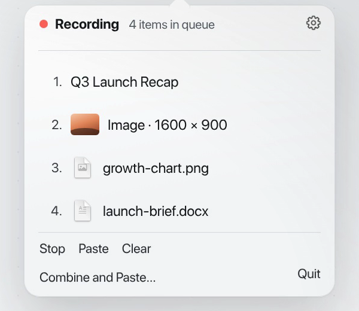
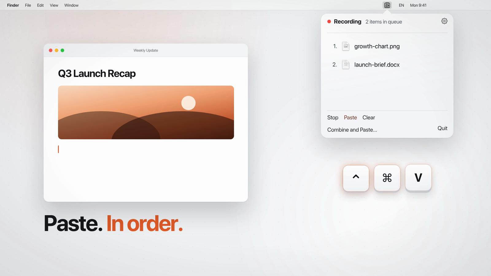

  

  <a href="https://vanto.slenbder.com"><b>vanto.slenbder.com</b></a>
  &nbsp;·&nbsp; macOS 13+ &nbsp;·&nbsp; Apple silicon
  &nbsp;·&nbsp; <a href="../../releases/tag/v1.0.0">Download 1.0.0</a>
  &nbsp;·&nbsp; <a href="CHANGELOG.md">Changelog</a>
  &nbsp;·&nbsp; <a href="ROADMAP.md">Roadmap</a>
  &nbsp;·&nbsp; <a href="docs/ARCHITECTURE.md">Architecture</a>

Vanto is a menu-bar utility for macOS that turns the clipboard into an ordered
queue. Press **⌃⌘C** to start collecting, copy things the usual way with ⌘C,
then press **⌃⌘V** to paste them back one by one, in the order you copied them.

This repository is the public home of the project: product overview, design
and engineering notes, roadmap, changelog, release downloads, and the issue
tracker. The application source code is private.

  

## What it does

- **Collects text, images, and files.** Finder selections (one file or many)
  and Photos items go into the queue as they are; up to 99 items.
- **First in, first out.** ⌃⌘V pastes the next item. The queue drains in the
  order you built it, not as a searchable history.
- **Arrange before you paste.** Drag to reorder, delete a single item, or
  clear everything from the popover.
- **Combine and Paste.** Merge two or more text items into one paste with a
  line break, space, comma, or your own separator.
- **Stays out of the way.** No Dock icon, no window. Ordinary ⌘C and ⌘V
  behave exactly as before unless you started collecting.
- **Local only.** No account and no cloud clipboard. Copied content never
  leaves your Mac, and the queue lives in memory.
- **Yours to configure.** Rebind both shortcuts, pick one of seven languages
  (English, Russian, Spanish, German, Japanese, Simplified Chinese, Brazilian
  Portuguese) independently of the system, and launch at login.

<table>
  <tr>
    <td width="38%"></td>
    <td></td>
  </tr>
</table>

## Status

**Vanto 1.0.0 is available** for Apple silicon Macs running macOS 13 or later.
Download the signed, notarized DMG from [GitHub Releases](../../releases/tag/v1.0.0)
or [the Vanto website](https://vanto.slenbder.com). Both locations offer the
same `Vanto-1.0.0.dmg`; its SHA-256 is
`3273cb11cb8409979137984d6b08b2d514a8d5c2ef76057be6423f4ea5fdfee7`.
See the [roadmap](ROADMAP.md) for what is next.

A 14-day free trial with every feature starts at first launch; no account is
needed to try it.

## Requirements

- macOS 13 Ventura or later
- An Apple silicon Mac (Intel is not supported)
- Accessibility permission, so Vanto can listen for its global shortcuts and
  paste into the app you are using

## Under the hood

Native Swift, AppKit for the status item and popover shell, SwiftUI for the
popover content. No web views, no Electron, no analytics in the app.

| Area | Approach |
|---|---|
| Global shortcuts | `NSEvent` global + local monitors, matched by the ASCII-capable layout's character so ⌃⌘C/⌃⌘V follow the physical key on Dvorak and AZERTY and keep working under Cyrillic or Japanese input |
| Clipboard capture | Polling `changeCount` every 0.25 s only while collecting; detection order is files → images → text |
| Paste | Restores focus to the app you came from, then posts a layout-aware synthetic ⌘V |
| Files | Copied into per-item storage on capture, so the original filename survives and same-name files never collide |
| Updates | Sparkle 2, fully automatic, EdDSA-signed archives |
| Licensing | Local trial clock in Keychain; license checks tolerate being offline |
| Quality | Automated unit tests behind dependency-injected seams for the pasteboard, keyboard layout, Keychain, network, and login items; CI on every pull request |

Read more in [docs/ARCHITECTURE.md](docs/ARCHITECTURE.md) and the reasoning
behind the main choices in [docs/DECISIONS.md](docs/DECISIONS.md).

## Feedback

Found a bug or missing something? [Open an issue](../../issues/new/choose) or
write to [vanto@slenbder.com](mailto:vanto@slenbder.com).

## License

The contents of this repository (text, images, and video) are © slenbder.
All rights reserved. Vanto is proprietary software.

---

Made by <a href="https://github.com/slenbder">Kirill</a> in Nha Trang.
