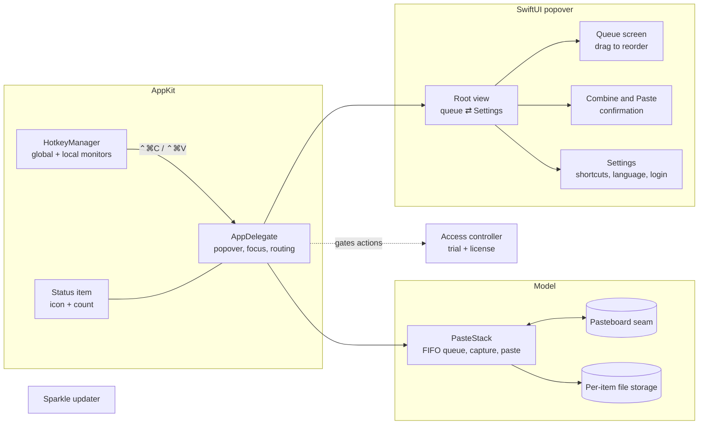

# Architecture

Vanto is a menu-bar-only macOS app (`LSUIElement`, no Dock icon) written in
Swift. AppKit owns the status item, the popover, and event plumbing; SwiftUI
draws everything inside the popover. It ships with App Sandbox **off**: a
sandboxed app cannot register global key monitors or post synthetic keyboard
events, and both are the product.

## Components

About twenty Swift files, each with one job: the queue model, the hotkey
manager, the shortcut model and recorder, the pasteboard seam, the language
store, the popover screens, the access controller, the license API client, and
the updater wrapper.

## Collecting

While collection is on, the model polls the pasteboard's `changeCount` every
0.25 seconds. It does nothing while collection is off, so ordinary copying is
never observed.

Detection order is **files → images → text**, and the order matters. Copying a
file in Finder puts a file URL on the pasteboard, and asking for an `NSImage`
at that point "succeeds" with the generic document icon instead of the file's
content. Checking for file URLs first avoids queuing the icon.

Files are copied at capture time into `ClipboardFiles/<item UUID>/<original
name>`. The UUID directory keeps two `Report.pdf` files apart while the pasted
file still arrives under its original name. Storage is scoped to the item and
cleaned up on removal, on Clear, shortly after the item is pasted, and for
orphans at launch.

Every pasteboard read and write goes through one protocol, so tests use an
in-memory pasteboard and never touch the system clipboard.

## Pasting

The paste path is split between the model and the app delegate:

1. Before the popover opens, the delegate remembers the frontmost external app.
2. A paste request from the popover first restores that app's focus; only when
   that succeeds does it ask the model to paste.
3. The model captures any copy still pending from the last poll, puts the
   queue head on the pasteboard, and posts a synthetic ⌘V. The V key code is
   looked up in the current layout's Command-modified table, so the right key
   is pressed on any layout.
4. The item leaves the queue only after the keystroke has been posted.

**Combine and Paste** follows the same focus route. The confirmation screen
records the IDs of the items it previewed; the paste is refused if the queue
changed in the meantime, and it requires every item to be text. The joined
string is pasted in one ⌘V, and leaving the screen or closing the popover
cancels a paste that is still waiting for the target app to activate.

## Shortcuts

Global and local `NSEvent` monitors are both registered: the global monitor
misses keystrokes while Vanto itself is active, the local one covers that.

Default shortcuts are matched by **character**, not key code. The physical key
code is translated through the ASCII-capable keyboard layout (`TIS` +
`UCKeyTranslate`), so ⌃⌘C follows the key labelled C on Dvorak or AZERTY and
keeps working when the active input source is Cyrillic or Japanese. The global
monitor sees every keystroke on the system, so the translation only runs for
key-downs that already carry the exact default modifiers.

Custom shortcuts are stored as a raw key code plus modifiers and matched
exactly, which is also what makes function keys bindable. Caps Lock and device
flags never block a match; Shift and Option do; key repeat is ignored. While a
shortcut is being recorded, both actions are suspended.

## Popover

The popover is created fresh on every open, so it always starts on the queue
screen with no stale drag or recording state. It closes on the status item,
an outside click, Escape, or when the last item has been pasted, and stays open
while a sequential paste still has items left. Reordering is a hand-written
`DragGesture` rather than `List(onMove:)`, measured in a coordinate space
anchored to the stable rows container so a dragged row never drifts.

The status item is a plain `NSStatusItem` with a template icon (idle and
collecting variants share one silhouette) and a separate label for the count.

## Localization

Seven languages ship in one string catalog. An in-app language override is
applied to the SwiftUI tree through the environment locale; strings built
outside SwiftUI, such as accessibility labels on the status item, resolve the
matching `.lproj` bundle explicitly, because a locale alone does not switch
bundles. The popover measures its localized header and grows past its 270 pt
minimum only when a language needs it.

## Access and updates

A 14-day trial runs on a local clock stored in Keychain; it needs no network,
and moving the system clock back does not extend it. After the trial, the
popover shows an activation screen and the shortcuts open it instead of
acting. The queue and everything in it are kept.

Licenses are activated, validated, and released through a public license API,
so no secret is embedded in the app. A license keeps working offline and
through temporary server errors; only an explicit "invalid" answer removes
an activation.

Sparkle 2 checks, downloads, and installs updates on its own. Archives are
EdDSA-signed, and the feed is served from the product website.

## Testing

The unit-test target injects every system boundary: pasteboard, ⌘V sender,
cleanup scheduler, Accessibility state, login-item service, shortcut and
language stores, a fixed keyboard layout, Keychain stores, a clock, and the
network loader. The test host returns before any production singleton,
polling timer, permission prompt, or real storage is touched. CI regenerates
the Xcode project, fails on drift, runs the tests, and builds Release on every
pull request.
